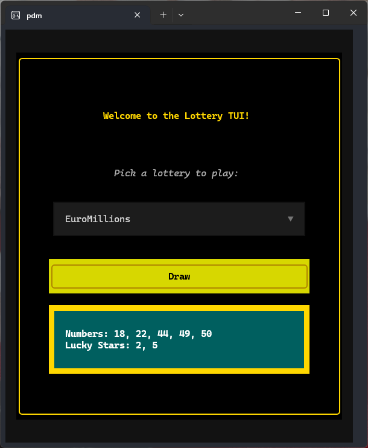

# Lottery TUI

[](https://pdm.fming.dev)
[](https://github.com/astral-sh/ruff)
[](https://pypi.org/project/lottery-tui)
[](https://pypi.org/project/lottery-tui)

-----



## Table of Contents

- [Installation](#installation)
- [License](#license)

## Installation

*with uv*

```console
uv tool install lottery-tui
```

*with pipx*

```console
pipx install lottery-tui
```

The TUI should now be discoverable as lottery-tui.

## Use

Launch the TUI, select a lottery and press the Draw button!

To exit from the application press *q* or *Ctrl+q*

## License

`lottery-tui` is distributed under the terms of the [MIT](https://spdx.org/licenses/MIT.html) license.
